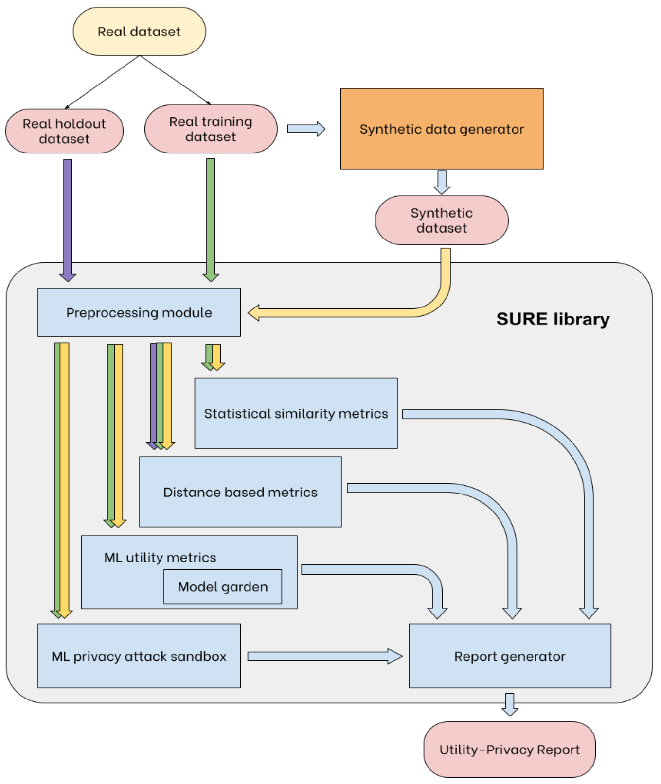

<a href="https://dario-brunelli-clearbox-ai.notion.site/SURE-Documentation-2c17db370641488a8db5bce406032c1f"></a>   

 

# SURE 
### Synthetic Data: Utility, Regulatory compliance, and Ethical privacy

The SURE package is an open-source Python library intended to be used for the assessment of the utility and privacy performance of any tabular synthetic dataset.

The SURE library features multiple Python modules that can be easily imported and seamlessly integrated into any Python script after installing the library. 

# Installation

To install the library run the following command in your terminal:

```shell
$ pip install sure
$ sh install.sh
```

### Modules overview

The SURE library features the following modules:

1. Preprocessor
2. Statistical similarity metrics
3. Model garden
4. ML utility metrics
5. Distance metrics
6. Privacy attack sandbox
7. Report generator

 **Preprocessor** 

The input datasets undergo manipulation by the preprocessor module, tailored to conform to the standard structure utilized across the subsequent processes. The Polars library used in the preprocessor makes this operation significantly faster compared to the use of other data processing libraries. 

 **Utility** 

The statistical similarity metrics, the ML utility metrics and the model garden modules constitute the data **utility evaluation** part.

The statistical similarity module and the distance metrics module take as input the pre-processed datasets and carry out the operation to assess the statistical similarity between the datasets and how different the content of the synthetic dataset is from the one of the original dataset.  In particular, The real and synthetic input datasets are used in the statistical similarity metrics module to assess how close the two datasets are in terms of statistical properties, such as mean, correlation, distribution.

The model garden executes a classification or regression task on the given dataset with multiple machine learning models, returning the performance metrics of each of the models tested on the given task and dataset.

The model garden module’s best performing models are employed in the machine learning utility metrics module to compute the usefulness of the synthetic data on a given ML task (classification or regression).

 **Privacy** 

The distance metrics and the privacy attack sandbox make up the synthetic data **privacy assessment** modules.

The distance metrics module computes the Gower distance between the two input datasets and the distance to the closest record for each line of the first dataset.

The ML privacy attack sandbox allows to simulate a Membership Inference Attack for re-identification of vulnerable records identified with the distance metrics module and evaluate how exposed the synthetic dataset is to this kind of assault.

 **Report** 

Eventually, the report generator provides a summary of the utility and privacy metrics computed in the previous modules, providing a visual digest with charts and tables of the results.

This following diagram serves as a visual representation of how each module contributes to the utility-privacy assessment process and highlights the seamless interconnection and synergy between individual blocks.



SURE library workflow.

# Usage

The library leverages Polars, which ensures faster computations compared to other data manipulation libraries. It supports both Polars and Pandas dataframes.

The user must provide both the original real dataset and the corresponding synthetic dataset to enable the library's modules to perform the necessary computations for evaluation.

Below is a code snippet example for the usage of the library:

```python
# Import the necessary modules from the SURE library
from sure import Preprocessor, report
from sure.utility import (statistical_similarity_metrics, compute_mutual_info,
			  compute_utility_metrics_class)
from sure.privacy import (distance_to_closest_record, dcr_stats, number_of_dcr_equal_to_zero, validation_dcr_test, 
			  adversary_dataset, membership_inference_test)

# Real dataset - Preprocessor initialization and query exacution
preprocessor            = Preprocessor(real_data, get_discarded_info=False)
real_data_preprocessed  = preprocessor.collect(real_data, num_fill_null='forward', scaling='standardize')

# Validation dataset - Preprocessor initialization and query exacution
preprocessor            = Preprocessor(valid_data, get_discarded_info=False)
valid_data_preprocessed = preprocessor.collect(valid_data, num_fill_null='forward', scaling='standardize')

# Synthetic dataset - Preprocessor initialization and query exacution
preprocessor            = Preprocessor(synth_data, get_discarded_info=False)
synth_data_preprocessed = preprocessor.collect(synth_data, num_fill_null='forward', scaling='standardize')

# Statistical properties and mutual information
num_features_stats, cat_features_stats, temporal_feat_stats = compute_statistical_metrics(real_data_preprocessed, synth_data_preprocessed)
corr_real, corr_synth, corr_difference                      = compute_mutual_info(real_data_preprocessed, synth_data_preprocessed)

# ML utility: TSTR - Train on Synthetic, Test on Real
X_train = synth_data_preprocessed.drop("label") # Assuming the datasets have a “label” column for the machine learning task they are intended for
y_train = synth_data_preprocessed["label"]
X_test  = real_data_preprocessed.drop("label").limit(10000) # Test the trained models on a portion of the original real dataset (first 10k rows)
y_test  = real_data_preprocessed["label"].limit(10000)
TSTR_metrics = compute_utility_metrics_class(X_train, y_train, X_test, y_test, predictions=False)

# Distance to closest record
dcr_train       = distance_to_closest_record(dcr_name="synth_train", synth_data_preprocessed, real_data_preprocessed)
dcr_valid       = distance_to_closest_record(dcr_name="synth_val", synth_data_preprocessed, valid_data_preprocessed)
dcr_stats_train = dcr_stats(dcr_name="synth_train", dcr_train)
dcr_stats_valid = dcr_stats(dcr_name="synth_valid", dcr_valid)
dcr_zero_train  = number_of_dcr_equal_to_zero(dcr_name="synth_train", dcr_train)
dcr_zero_valid  = number_of_dcr_equal_to_zero(dcr_name="synth_val", dcr_valid)
share           = validation_dcr_test(dcr_train, dcr_valid)

# ML privacy attack sandbox initialization and simulation
adversary_dataset = adversary_dataset(real_data_preprocessed, valid_data_preprocessed)
adversary_guesses_ground_truth = adversary_dataset["privacy_test_is_training"]
MIA               = membership_inference_test(adversary_dataset, synth_data_preprocessed, adversary_guesses_ground_truth)
```

Please review the dedicated documentation to learn how to further customize your synthetic data assessment pipeline.

