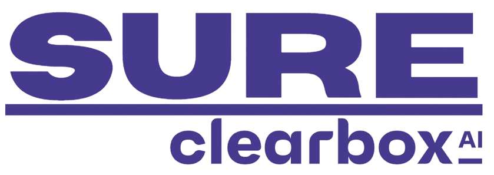

.. Clearbox SURE documentation master file, created by
   sphinx-quickstart on Mon Nov 18 15:46:14 2024.
   You can adapt this file completely to your liking, but it should at least
   contain the root `toctree` directive.

.. include:: doc_1.md
   :parser: markdown

.. include:: doc_2.md
   :parser: markdown

.. toctree::
   :maxdepth: 2
   :caption: Contents:

Modules
-------

.. toctree::
   :maxdepth: 2

   api/sure.rst

Indices and tables
------------------

* :ref:`genindex`
* :ref:`modindex`
* :ref:`search`